#Mục lục
*	[I. Log Trong Linux](#log)

*	[II. Giới thiệu về Graylog](#gt)
	*	[1. Giới thiệu chung](#gtc)
	*	[2. Đặc điểm nổi bật](#dd)
	*	[3. Cấu trúc logical](#ct)
	*	[4. Mô hình triển khai](#mh)
	
*	[III. Triển khai Graylog với mô hình OpenStack Mitaka](#tk)
	*	[1. Cấu hình máy Graylog Server](#ch)
	*	[2. Chạy script](#sc)
		*	[2.1. Cài Graylog Server](#cd)
		*	[2.2. Cấu hình Input](#chinput)
		*	[2.3 Demo tạo Dashboard](#dm)
		
## I. Log trong Linux
<a name="log"> </a> 
Một trong những điều khiến GNU/Linux trở thành một hệ điều hành tuyệt vời đó là các thông tin về mọi thứ diễn ra trong hệ thống, hay những ứng dụng
 chạy trên nó sẽ luôn được ghi lại. Mỗi khi có sự cố xảy ra - và thực sự nó rất thường xuyên xảy ra, thì những thông tin này trở nên vô cùng quý giá trong việc 
khắc phục. Các thông tin trên thường được ghi lại dưới dạng văn bản, được gọi là cái file log.

- Tại sao ứng dụng của tôi không thể khởi động lên được?
- Có bao nhiêu người đã SSH vào server của tôi trong vòng 3 ngày qua?
- Ai đó hôm qua đã VPN vào hệ thống và lấy đi 1 tài liệu rất quan trọng, tôi có thể kiểm tra được đó là ai không?
- Tôi có thể thống kê được số VM được tạo, được xóa trên hệ thống cloud của tôi không?
...

Cả trăm câu hỏi như vậy được đặt ra, và đều có chung một câu trả lời : **Hãy xem các file log !!!**

Các file log sẽ cho bạn tất cả các thông tin cần thiết, miễn là bạn biết được file log cần xem nằm ở đâu.

Các file log được ghi dưới dạng văn bản, vậy nên bạn có thể vô cùng dễ dàng dùng các kỹ thuật đọc và tìm kiếm văn bản trong Linux để đọc log như 
``tail ``, ``find``, ``awk``, ``grep``... 

Hệ thống với quy mô 1 vài chục server?. Ok, fine! Bạn vẫn có thể dễ dàng dễ dàng SSH vào từng server, kiểm tra các file log. Nhưng với hệ thống
lên tới vài trăm, vài nghìn máy chủ thì sao? Bạn không thể lúc nào cũng biết chính xác được mình cần tìm đến file log nào!

Vậy nên các giải pháp log tập trung bắt đầu ra đời. Các server, bằng những cách khác nhau, sẽ đẩy các file log tại máy local tập trung về một máy log 
server. Các giải pháp log tập trung không chỉ giúp người quản trị có thể quản lý log của các máy client một cách dễ dàng hơn. Mà còn giúp người 
quản trị khai thác tối đa được lợi ích từ các file log.

**Mô hình log tập trung**


Dựa vào các trải nghiệm khi làm việc với các giải pháp log tập trung khác nhau, cũng như do đặc trưng và yêu cầu của hệ thống OpenStack đặt ra,
 tôi xin được giới thiệu giải pháp log tập trung đang được tôi tin dùng, đó là Graylog.

## II. Giới thiệu về Graylog
<a name="gt"> </a> 

###1. Giới thiệu chung
<a name="gtc"> </a> 

 Graylog là phần mềm mã nguồn mở quản lý log tập trung, bắt đầu phát triển vào 2010 bởi Lennart Koopman (người Đức) với tên Graylog2. Vào tháng 
 2 năm 2014, phiên bản Graylog2 version 0.20.0 chính thức được phát hành. Vào tháng 1 năm 2015, phiên bản Graylog 1.0 Beta
ra đời, đổi tên từ Graylog2 thành Graylog, và Graylog Inc được thành lập. 

 Từ version 1.0, Graylog đã trải qua 5 phiên bản, version mới nhất là Graylog 2.0.3, phiên bản ổn định là Graylog 1.3.
 
###2. Đặc điểm nổi bật
<a name="dd"> </a> 

- Việc triển khai và cài đặt dễ dàng.
- Graylog có thể nhận log từ rất nhiều khác nhau : log của các server Linux, Window, thiết bị mạng như router, switch, firewall, các thiết bị 
lưu trữ như CEPH.
- Sử dụng công cụ chuyên dụng để tìm kiếm là Elastisearch, giúp việc tìm kiếm các bản tin log đuọc dễ dàng, nhanh chóng và chính xác.
- Phân tích các số liệu các được từ các file log thành dạng số liệu, biểu đồ thống kê, tổng hợp lại trong các dashboard.
- Cơ chế cảnh báo qua Email, Slack.
- Khả năng tích hợp mạnh mẽ với các phần mềm khác bằng cách sử dụng cơ chế plugin, bạn có thể dễ dàng tích hợp Graylog với các LDAP, Graphite/Ganglia, 
Logstash, NetFlow...

Đặc biệt, không chỉ tự mình thu thập log, từ phiên bản 2.0, Graylog có thể đóng vai trò quản lý và trung gian. Với các server có sẵn có chế thu
thập log như nx-log, hay logstash, bạn có thể thu thập log từ chính các cơ chế có sẵn này. Graylog còn có thể làm trung gian, đẩy log thu được 
tới bên thứ 3 sử dụng.

###3. Cấu trúc logical
<a name="ct"> </a> 


Graylog có 4 thành phần chính :
- Graylog Server:  Nhận, xử lý các bản tin và truyền thông với các thành phần khác – Cần CPU. 
- Elasticsearch:	 Công cụ lưu trữ, tìm kiếm dữ liệu - tất cả phụ thuộc vào tốc độ I/O, Cần RAM. 
- MongoDB:	 	 Lưu trữ metadata ( file cấu hình…). Chỉ cần cấu hình thấp.
- Web Interface: 	 Cung cấp giao diện cho người dùng.

Trong mô hình này, Graylog sử dụng lại 2 opensource software có sẵn từ bên ngoài là Elasticsearch và MongoDB.

Từ phiên bản Graylog 2.0, thành phần web-interface đuọc tích hợp cùng với graylog-server.

###4. Mô hình triển khai
<a name="mh"> </a> 

Dựa vào document của Graylog, có 2 mô hình được khuyến cáo sử dụng. 

**Mô hình Minimum setup.**


Cả 4 thành phần của Graylog được cấu hình trên cùng 1 con server.

**Mô hình Bigger production setup.**


Các thành phần của Graylog được tách riêng, và ta có thể triển khai các cơ chế như Load Balancer, HA, Cluster
cho từng thành phần.

##III. Triển khai Graylog với mô hình OpenStack Mitaka
<a name="tk"> </a> 

Tôi sẽ triển khai phiên bản Graylog ổn định nhất là version 1.3

###1. Cấu hình máy Graylog Server
<a name="chm"> </a> 

<li>OS: Ubuntu Server 14.04 64 bit</li>
<li>RAM: 4GB</li>
<li>CPU: 2x2</li>
<li>NIC1: eth1: 172.16.69.0/24, gateway 172.16.69.1 (sử dụng card NAT hoặc Bridge VMware Workstation)</li>
<li>HDD: +60GB</li>
###2. Chạy script
<a name="sc"> </a> 

#### Mô hình 


####2.1. Cài Graylog Server
<a name="cd"> </a> 

 - Với Graylog Server
 
 ```sh
 wget https://raw.githubusercontent.com/vietstacker/Monitor-Logging-OpenStack/master/scipts/graylog-server.sh
 bash graylog-server.sh
 ```

 
 #####Một số *lưu ý* khi chạy script:
 
 - Nhập password cho admin khi đăng nhập vào Web-interface
 
 

 - Ấn phím *ENTER* để tiếp tục
 
 

 Sau đó đợi script chạy hết.
 
####2.2. Cấu hình Input cho Graylog trên Web-interface
<a name="chinput"> </a> 

#####Step1 : 

- Đăng nhập WEB Interface của Graylog : http://IP-Graylogserver:9000
 
 

#####Step 2 : 
- Tạo Input trên Graylog. Input giống như một địa chỉ nhà, các bản tin từ máy client sẽ được cung cấp thông tin về địa chỉ đó để có thể đẩy được log về cho Graylog Server.

 
 
 
 
 Một số mục cần lưu ý khi nhập thông tin :

•	Bind IP : Nhập IP của Graylog-Server  hoặc 0.0.0.0 ( Nếu đặt 0.0.0.0 Graylog server sẽ lắng nghe tất cả các bản tin trả về, chỉ đặt nếu đã thiết lập IPTables)

•	Port : Chú ý đặt trùng với port thiết lập trong file config của máy Collector Client ( mặc định của cả 2 là 12201 )

•	Bạn có thể tìm hiểu thêm về cơ chế đẩy log với TLS để sử dụng TLS với Graylog-Colector để bảo mật tốt hơn khi truyền các bản tin log.

Sau khi launch xong input, cần có 2 phần của Input cần lưu ý

 
 
1 : Kiểm tra xem các bản tin log đã được đẩy về hay chưa. ( Các bản tin sẽ bắt đầu đẩy về sau khi graylog-collector service khởi động )

2 : Quản lý các extractor được tạo ở phần searching. Tham khảo về [Extractorơ](https://github.com/hocchudong/ghichep-graylog/blob/master/graylog/graylog-web%20interface/Graylog-Interface.md) ở mục 6.2.

####2.3. Cấu hình Graylog Collector trên 2 node Controller và Compute
<a name="chcollector"> </a> 

Graylog Collector là một ứng dụng Java kích thước nhẹ cho phép bạn chỏ cụ thể data từ log files tới một Graylog Cluster. Collector có thể đọc log files local ( Ví dụ apache, openvpn,...), nói chung bất cứ dịch vụ nào có ghi log.
- Trên node Controller :
```sh
wget https://raw.githubusercontent.com/vietstacker/Monitor-Logging-OpenStack/master/scipts/graylog-collector.sh
bash graylog-collector.sh
```
Ta sẽ lấy một số log cơ bản và log của các service OpenStack trên máy Controller

- Nhập các thông số tại : **/etc/graylog/collector/collector.conf**

**File cấu hình Collector mẫu của node Controller** 

 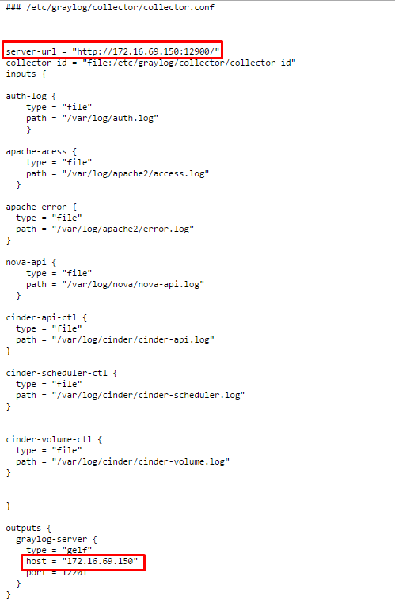
 
<ul>
<li>Tại : **server-url** và **host** : thay bằng địa chỉ của Graylog-server. </li>
<li>Tại : **input** : khai báo thêm các file log mà bạn muốn lấy về. </li>
</ul>

- Khởi động dịch vụ Graylog-collect
```sh
service graylog-collector start
```
- Đăng nhập Horizon và kiểm tra log của apache được đẩy về Graylog-Server
 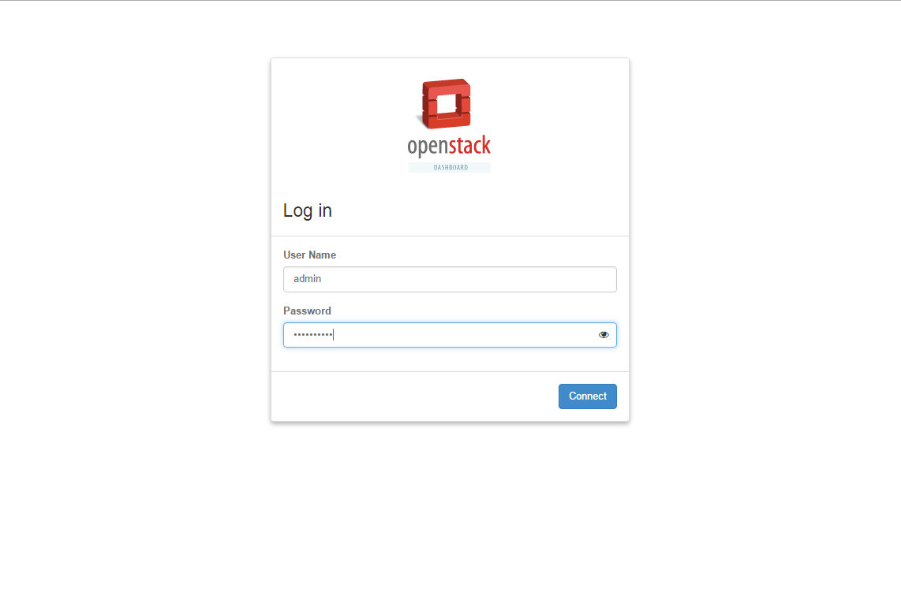
 
Log từ file **/var/log/apache2/access.log** đã được đẩy về Graylog 

 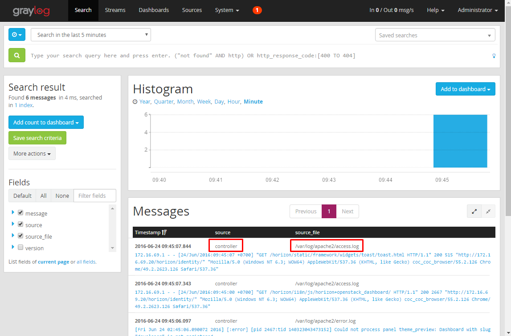
 
- Trên node Compute :

Làm tương tự theo các bước tại node Controller, chỉ thay đổi phần input tại file **/etc/graylog/collector/collector.conf**

####2.3 Demo tạo Dashboard thống kê số đăng nhập Horizon thất bại, list ra user đăng nhập thất bại.
<a name="dm"> </a> 

**Step 1** : Tạo Dashboard có tên : Login Horizon Fail

 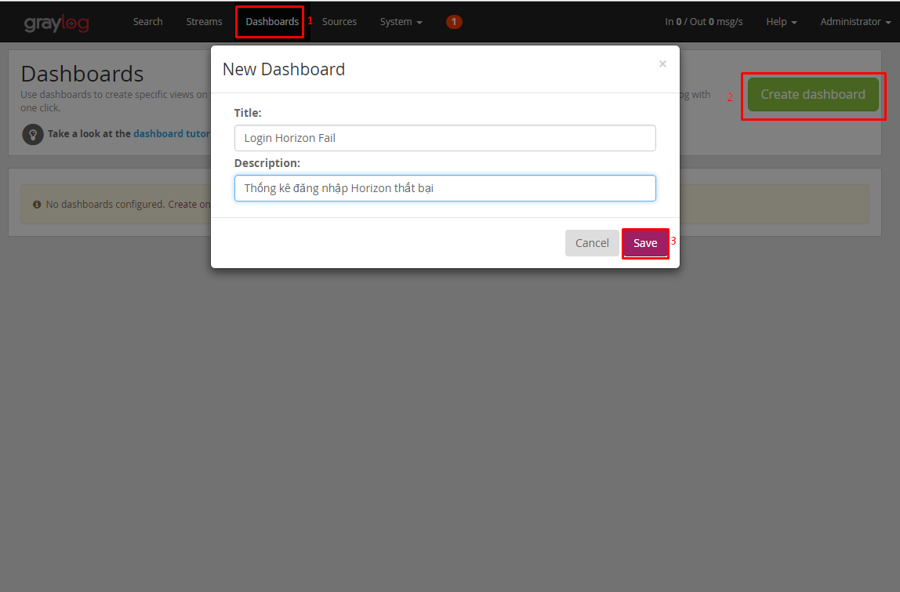
 
**Step 2** : Đăng nhập Horizon với 1 user không hợp lệ 

 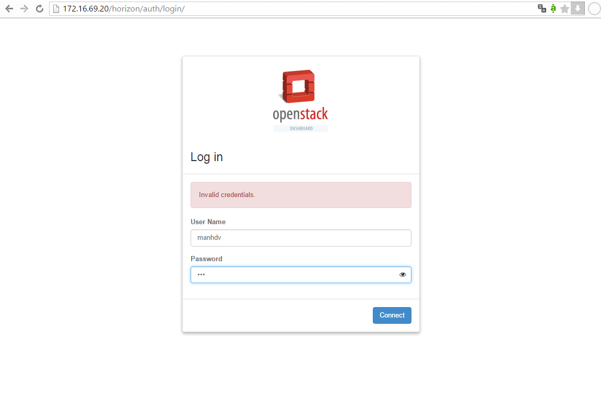
 
**Step 3** : Trên Graylog WebInterface, xuất hiện bản tin với user đăng nhập thất bại. Ta sẽ sử dụng kỹ thuật Regular Expression để cắt lấy thông
tin về user đăng nhập thất bại.

 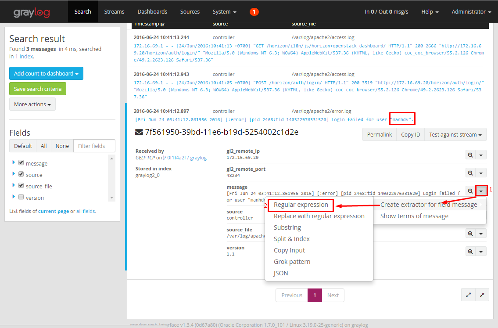
 
Tham khảo link về sử dụng kỹ thuật [Regular Expression](https://github.com/hocchudong/ghichep-regex)

**Step 4** : Sủ dụng regex để cắt lấy thông tin user

 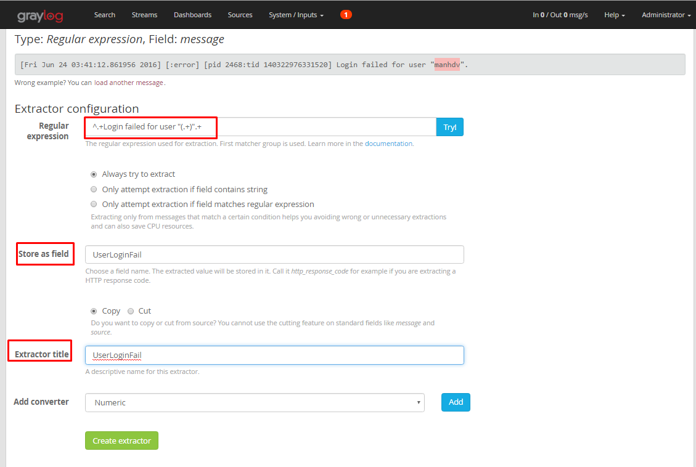

**Step 5** : Login Horizon với user không hợp lệ 1 lần nữa để Field **UserLoginFail** được kích hoạt. Ta sẽ thống kê số đăng nhập và user đăng 
nhập Horizon thất bại.

 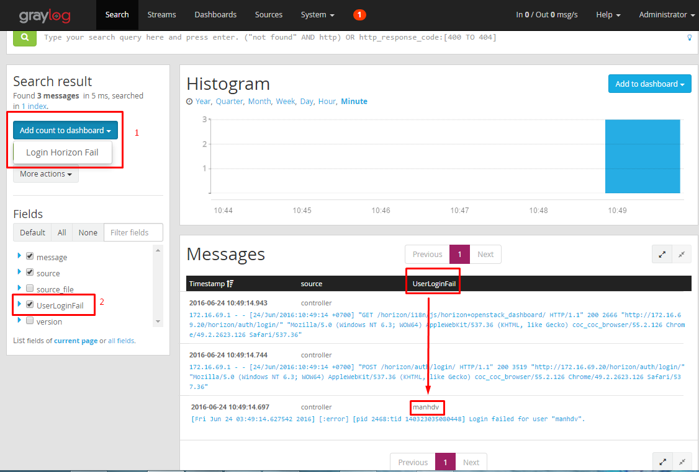
 
**1** :Thêm thống kê số bản tin vào Dashboard **Login Horizon Fail**

 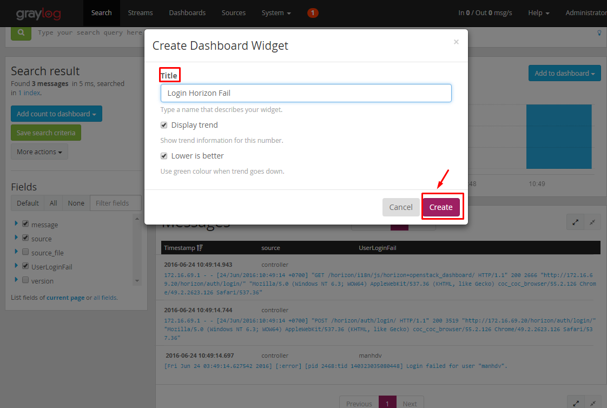

**2** : Thêm thống kê user đăng nhập horizon thất bại vào Dashboard **Login Horizon Fail**

 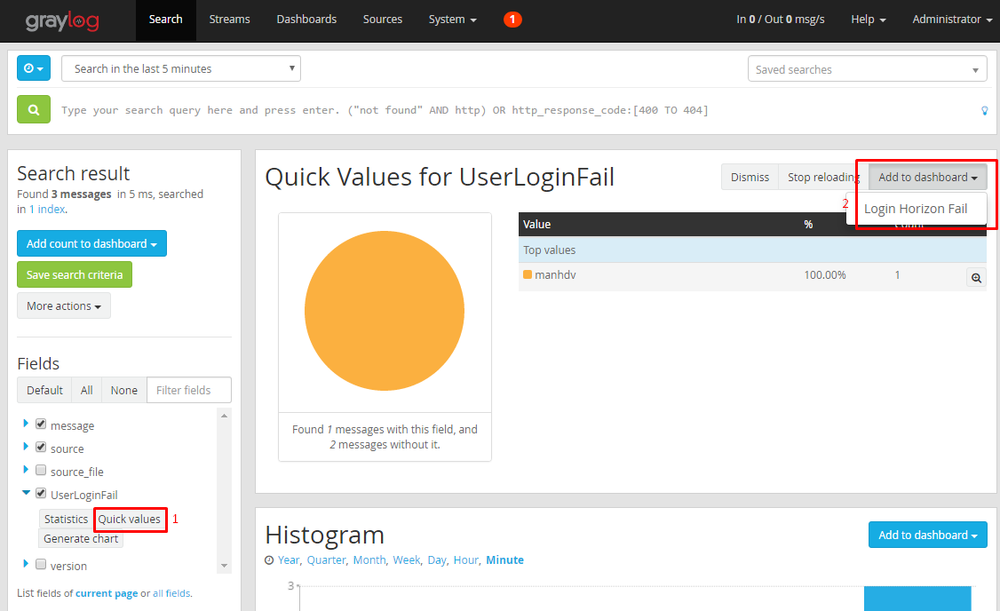
 
 
Dashboard được tạo :

 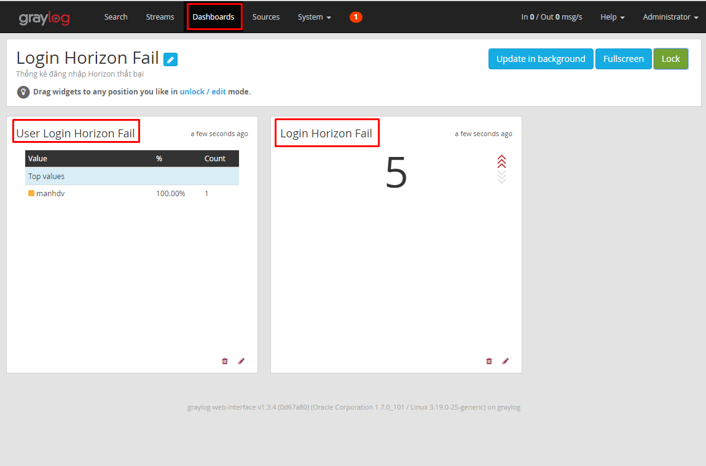
 
- Trên node Compute, việc cấu hình tương tự như trên Controller, chỉ thay đổi phần input trong file collector.conf

**File cấu hình Collector mẫu của node Compute** 

 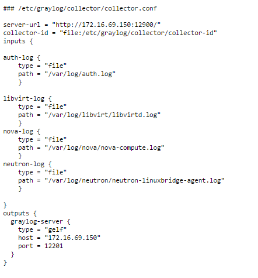

Kiểm tra các source log :

 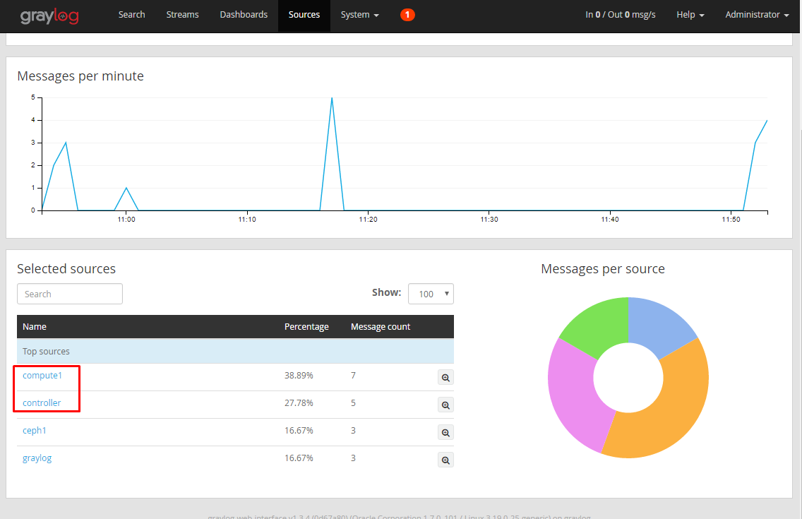
 
Tham khảo các bài viết nâng cao về Graylog theo link [sau](https://github.com/hocchudong/ghichep-graylog)